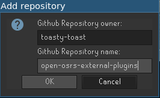
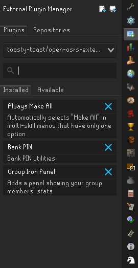

# Getting Started

Toast Plugins is a collection of plugins for the [OpenOSRS](https://openosrs.com/) RuneScape client.

Each plugin has its own page on this site explaining how to set it up and use it.

## Setting up the repository

The plugins are added to OpenOSRS through the External Plugin Manager. You can follow the steps below.

1. In the External Plugin Manager tab click the button to add a new Github Repository.
1. Enter the following information for the repository and click OK.

1. In the External Plugin Manager select the Plugins tab, then select toasty-toast/open-osrs-external-plugins from the drop down.
1. In the Installed tab you will see the plugins you have already installed. In the Available tab you will see the plugins available for you to install by clicking the green plus sign button next to the plugin.

1. Once a plugin is installed you can start using it. If you have questions about a particular plugin, go check out that plugin's documentation.