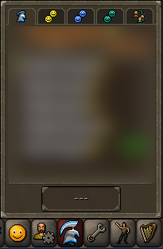
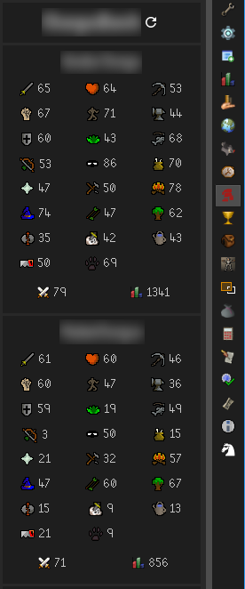

# Group Iron Panel

The Group Iron Panel plugin adds a new panel on the right hand side of the client which shows the stats for everyone in your Group Iron group.

## Setup

The plugin will auto-detect your group whenever you open the Group Iron menu in game. You only need to do this once and the plugin will remember your group from that point on. If your group ever changes, just open the menu again and the plugin will detect the new group.

Once you open the Group Iron menu in the game once, you should see the Group Iron Panel in the sidebar of the client update with your group's information. You can use the Refresh button at the top of the panel to reload the group's stats.

